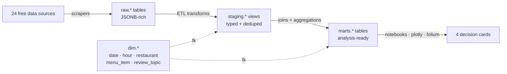

# Neptune Oyster — Data-to-Decisions

A didactic data-engineering project: scrape every free public signal about **Neptune Oyster** (63 Salem St, North End, Boston, MA), warehouse it in Postgres, and turn it into four concrete business decisions — **staffing & hours, pricing, marketing timing, operations fixes**.

> **Status:** active development.
> Phase 1 (foundation: schema, seeds, DB pool) ✅
> Phase 2+ (scrapers, ETL, modeling, demo): in progress.
> See [Roadmap](#roadmap) for the running checklist.

---

## Stack

- **Python 3.12**, dependencies managed with [`uv`](https://docs.astral.sh/uv/)
- **PostgreSQL 16** + **PostGIS 3.4** in Docker
- **psycopg 3** with a process-wide connection pool
- **httpx** for JSON APIs · **Playwright** for review sites · vendor SDKs (`praw`, `instaloader`, `populartimes`) for niche sources
- **pandas · scipy · statsmodels · scikit-learn** for analysis and modeling
- **plotly · folium · seaborn** for figures and maps
- **Jupyter** notebooks as the final delivery format

## Quick start

```bash
# 1. Clone
git clone git@github.com:Justocel/neptune.git
cd neptune

# 2. Secrets — copy the template and set a strong password
cp .env.example .env
openssl rand -base64 32            # generate a candidate POSTGRES_PASSWORD
$EDITOR .env                       # paste it; leave external API keys blank for now

# 3. Postgres
docker compose up -d
docker compose ps                  # wait for STATUS = Up X (healthy)

# 4. Python deps (creates .venv, installs `neptune` package editably)
uv sync

# 5. Schema migrations (idempotent — safe to re-run)
for f in sql/*.sql; do
  echo "=== Applying $f ==="
  docker compose exec -T postgres psql -U neptune -d neptune \
    -v ON_ERROR_STOP=1 -f "/sql/$(basename "$f")"
done

# 6. Smoke-test the DB pool
uv run python -m neptune.db
```

Expected output of step 6:

```python
{'database': 'neptune', 'user': 'neptune',
 'version': 'PostgreSQL 16.x ...', 'project_tables': '27'}
```

`27 = 5 dim + 18 raw + 4 marts` tables.

## Architecture



| Schema    | Purpose                                                       | Pattern                                                                                                                                |
| --------- | ------------------------------------------------------------- | -------------------------------------------------------------------------------------------------------------------------------------- |
| `dim.*`   | Canonical lookup data (date, hour, restaurant, items, topics) | Hand-curated, seeded by `sql/0003_dim.sql`                                                                                             |
| `raw.*`   | As-scraped payloads                                           | One table per source. Always has a `raw JSONB` column + indexable filter columns + `ingested_at`. GIN index on `raw` for ad-hoc JSONB. |
| `staging.*` | Typed, deduped, FK-resolved                                   | Mostly views over `raw`. Added incrementally per source.                                                                               |
| `marts.*` | Analysis-ready flat tables                                    | What notebooks query. Four mart tables map 1-to-1 to the four decision cards.                                                          |

## Project layout

```
neptune/
├── docker-compose.yml          # postgres 16 + postgis 3.4
├── pyproject.toml              # python deps (managed by uv)
├── uv.lock                     # pinned exact versions — committed
├── .env.example                # secrets template; copy to .env
├── sql/                        # numbered migrations, applied in order
│   ├── 0001_extensions.sql     # postgis, pg_trgm
│   ├── 0002_schemas.sql        # dim / raw / staging / marts
│   ├── 0003_dim.sql            # 5 dim tables + ~4.7k row seeds
│   ├── 0004_raw.sql            # all 18 raw.* tables
│   ├── 0005_staging.sql        # placeholder (views added per source)
│   └── 0006_marts.sql          # 4 marts.* tables
├── src/neptune/
│   ├── config.py               # pydantic-settings, loads .env
│   ├── db.py                   # psycopg pool + healthcheck
│   ├── scrapers/               # one module per data source
│   ├── etl/                    # raw → staging → marts transforms
│   ├── models/                 # SARIMAX, sentiment, topic classifier
│   ├── stats/                  # hypothesis tests
│   └── viz/                    # plotly / folium / seaborn figures
├── notebooks/                  # one notebook per decision card
└── tests/
```

## Data sources

Backfill = horizon for the historical pull. **Snapshot** = current state only; per-date history not free.

| # | Source                  | Method     | Auth          | Backfill            | Target table                  | Status |
|---|-------------------------|------------|---------------|---------------------|-------------------------------|--------|
|  1 | Open-Meteo (weather)   | HTTP       | none          | 3y hourly           | `raw.weather_obs`             | ⬜ |
|  2 | NHL — Bruins schedule  | HTTP       | none          | 3y                  | `raw.sports_events`           | ⬜ |
|  3 | NBA — Celtics schedule | `nba_api`  | none          | 3y                  | `raw.sports_events`           | ⬜ |
|  4 | Yelp reviews           | Playwright | none          | all-time            | `raw.reviews`                 | ⬜ |
|  5 | Google reviews         | Playwright | none          | all-time            | `raw.reviews`                 | ⬜ |
|  6 | TripAdvisor reviews    | Playwright | none          | all-time            | `raw.reviews`                 | ⬜ |
|  7 | Reddit mentions        | `praw`     | OAuth (free)  | all-time search     | `raw.reddit_mentions`         | ⬜ |
|  8 | Instagram              | `instaloader` | optional   | all posts           | `raw.instagram_posts`         | ⬜ |
|  9 | Google Popular Times   | `populartimes` | API key   | snapshot only       | `raw.popular_times`           | ⬜ |
| 10 | Menu — Neptune         | scrape     | none          | snapshot + Wayback  | `raw.menu_snapshot`           | ⬜ |
| 11 | Menu — 5 competitors   | scrape     | none          | snapshot + Wayback  | `raw.menu_snapshot`           | ⬜ |
| 12 | NOAA Fisheries landings| HTTP       | none          | monthly 5y          | `raw.noaa_landings`           | ⬜ |
| 13 | BLS CPI                | HTTP       | free key      | monthly 3y          | `raw.bls_cpi`                 | ⬜ |
| 14 | Boston 311             | CKAN       | none          | 3y                  | `raw.boston_311`              | ⬜ |
| 15 | Boston food inspections| CKAN       | none          | 3y                  | `raw.boston_inspections`      | ⬜ |
| 16 | Boston permits         | CKAN       | none          | 3y                  | `raw.boston_permits`          | ⬜ |
| 17 | Boston liquor licenses | CKAN       | none          | snapshot            | `raw.boston_liquor_licenses`  | ⬜ |
| 18 | Bluebike trips         | S3 CSVs    | none          | 3y monthly          | `raw.bluebike_trips`          | ⬜ |
| 19 | MassGIS layers         | shapefile  | none          | one-shot            | direct PostGIS load            | ⬜ |
| 20 | MBTA-Performance V3    | API        | free key      | ≤30d                | `raw.mbta_ridership`          | ⬜ |
| 21 | Massport cruise        | scrape     | none          | current + Wayback   | `raw.massport_cruise`         | ⬜ |
| 22 | Census ACS             | API        | free key      | latest 5y release   | `raw.census_acs`              | ⬜ |
| 23 | OSM Overpass           | API        | none          | one-shot            | `raw.osm_pois`                | ⬜ |
| 24 | Wayback Machine        | CDX API    | none          | full history        | `raw.menu_snapshot` backfill  | ⬜ |

Legend: ⬜ not started · 🚧 in progress · ✅ collecting data

## External API keys

Several sources need a free key. Add the value to `.env`; never commit `.env`.

- [ ] **BLS** — https://data.bls.gov/registrationEngine/ → `BLS_API_KEY`
- [ ] **Census ACS** — https://api.census.gov/data/key_signup.html → `CENSUS_API_KEY`
- [ ] **MBTA-Performance** — https://api-v3.mbta.com/ → `MBTA_API_KEY`
- [ ] **Reddit (PRAW)** OAuth app — https://www.reddit.com/prefs/apps → `REDDIT_CLIENT_ID`, `REDDIT_CLIENT_SECRET`
- [ ] **Google Maps Places** (for `populartimes`) — Cloud Console; **billable** but the free monthly credit covers our snapshot usage → `GOOGLE_MAPS_API_KEY`
- [ ] **Instagram** login (optional, only if `instaloader` hits rate limits) → `INSTAGRAM_USERNAME`, `INSTAGRAM_PASSWORD`

## The four decision cards

The terminal artifact is one demo notebook (`notebooks/99_demo.ipynb`) plus four figures:

1. **Hours & staffing.** Hourly demand forecast for the next 7 days under swappable weather + sports scenarios. Model: SARIMAX, weekly seasonality (`s=168`), exogenous regressors `temp_c, precip_mm, wind_mps, bruins_home_today, celtics_home_today, cruise_ship_count, is_feast_day, is_us_holiday`.
2. **Pricing.** Neptune's lobster roll and top-5 oyster varieties versus five peer restaurants over time, with z-score band for market position.
3. **Marketing timing.** Does Instagram engagement Granger-cause busyness 24/48 h later? Tourist-vs-local rating distributions.
4. **Operations fixes.** Top 5 rising and falling review topics, last 30 days vs. trailing-12-month baseline; drill-down to example reviews.

Each card is backed by hypothesis tests with **Benjamini–Hochberg** FDR correction applied *within each card's family*. ~15 tests total. See `plan.md §4` for the full test matrix (H₀, statistic, data slice).

## Honest gaps & caveats

- **No free historical hourly foot traffic.** Google's Popular Times exposes the *typical week*, not per-date history. SafeGraph and Placer.ai have it but are paid. Workaround: typical-week as baseline, weather + events as deviation drivers, Bluebike + MBTA as foot-traffic proxies.
- **Instagram rate-limits scrapers aggressively.** Plan 2–3 days of staggered, backed-off fetches.
- **Yelp / Google scraping is ToS-gray-zone.** Personal/didactic use only, low concurrency, polite delays, no redistribution. Caches mean we only fetch each review once.
- **Topic classification is the hardest qualitative step.** Plan: KeyBERT for candidates → hand-curated ~20-topic taxonomy → multilabel classifier on ~2 000 hand-labeled reviews. Fallback if accuracy is poor: keyword search.
- **Tests prove association, not causation.** Narrative avoids overclaiming.

## Roadmap

| Week | Focus                                              | Status |
|------|----------------------------------------------------|--------|
| 1    | Env, Docker, schema, dim seeds, DB pool            | ✅     |
| 2    | Weather + sports scrapers; first review scraper    | 🚧     |
| 3    | Remaining review scrapers; gov + geo data          | ⬜     |
| 4    | ETL: `raw → staging → marts`                       | ⬜     |
| 5    | SARIMAX + 15 hypothesis tests with BH correction   | ⬜     |
| 6    | Demo notebook + figures + slide-export             | ⬜     |

## Day-to-day commands

```bash
# Open psql inside the running container
docker compose exec postgres psql -U neptune -d neptune

# Re-apply all migrations (idempotent; safe to re-run)
for f in sql/*.sql; do
  docker compose exec -T postgres psql -U neptune -d neptune \
    -v ON_ERROR_STOP=1 -f "/sql/$(basename "$f")"
done

# Stop containers (data persists in the named volume)
docker compose down

# Nuke EVERYTHING including the data volume
docker compose down -v
```

## License

TBD. Until a `LICENSE` file is added, no rights beyond personal review are granted. Scraped review data is treated as didactic use only — see [Honest gaps](#honest-gaps--caveats).
